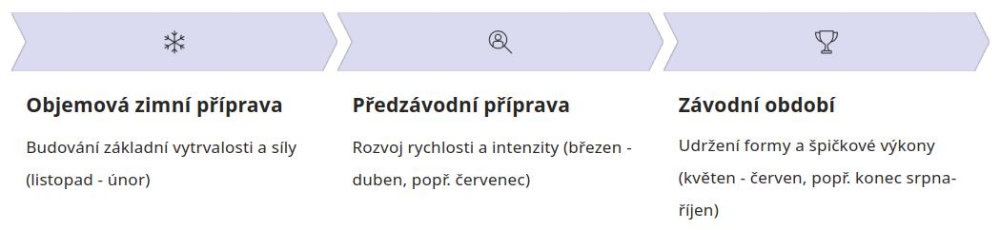

# Struktura tréninkového roku

Tréninkový proces neprobíhá v každé fázi tréninkového roku stejně, jelikož by docházelo k přetrénování organismu. V ROB předpokládáme vrchol sezóny na konci srpna, popřípadě začátku září, kdy se koná ME/MS, případně domácí MČR. V případě posunu vrcholu je potřeba adekvátně upravit rozložení daných období.

## Zimní příprava
V této fázi je důraz kladen na budování vytrvalosti a síly. Intenzita tréninku je většinou nižší, běhají se dlouhé objemové běhy (cca 1,5 h a více). Část této přípravy je možné doplnit jinými aktivitami (běh na lyžích, posilovna), nicméně **samy o sobě nejsou schopné běh nahradit**!

Časově se jedná o období od listopadu do cca konce února, během kterých by měl závodník naběhat přibližně XX procent objemu. Nedostatečná příprava v této fázi vede k větší náchylnosti na zranění ze začátku závodní sezóny.

## Předzávodní příprava
Během předzávodní přípravy dochází k postupnému zrychlování a rozvoji rychlosti, vyplatí se zařazovat dráhové a tempové úseky, běhy do kopců a obdobné prvky. Právě v této fázi se stále dá částečně "dotrénovat" výpadek z předchozí fáze (například způsobený nemocí). Tato fáze trvá od začátku března po začátek závodního období (v ROB obvykle cca půlka dubna). Do této fáze se též často přechází v období letních prázdnin, kdy jarní část sezóny končí a je potřeba se začít postupně připravovat na podzimní.

## Závodní období
V závodním období je cílem udržet závodní výkonnost mezi závody a předcházet zraněním plynoucím z přetrénovanosti. Tréninky bývají intenzivní, ale zato kratší, aby zbytečně nevyčerpávaly tělo mezi závody. Před důležitými závody je potřeba vyladit formu individuálně.

V tomto období nebývá často tolik dní mezi závody na regeneraci, o to více je potřeba regenerovat kvalitně – mít dostatek dobrého spánku, vhodnou stravu či případně zařadit další regerační aktivity (sauna, plavání, masáže atd.).

